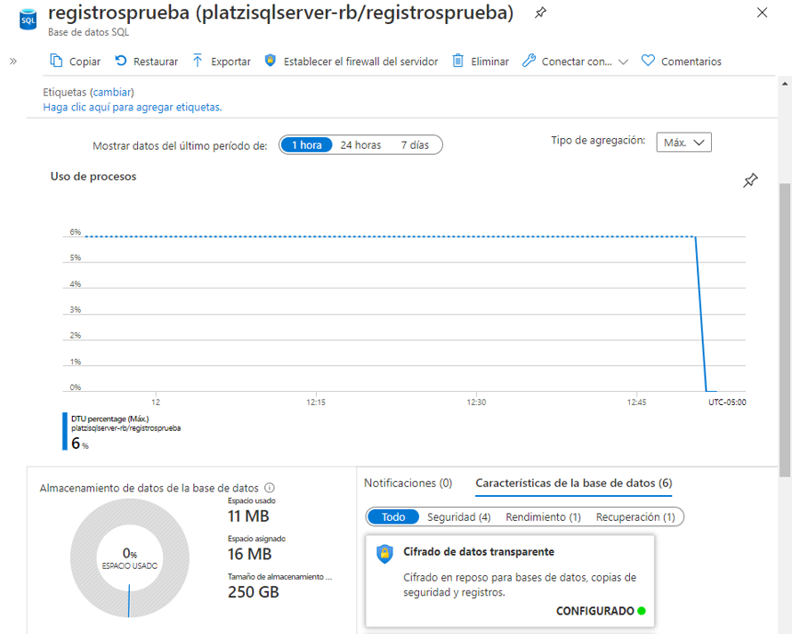
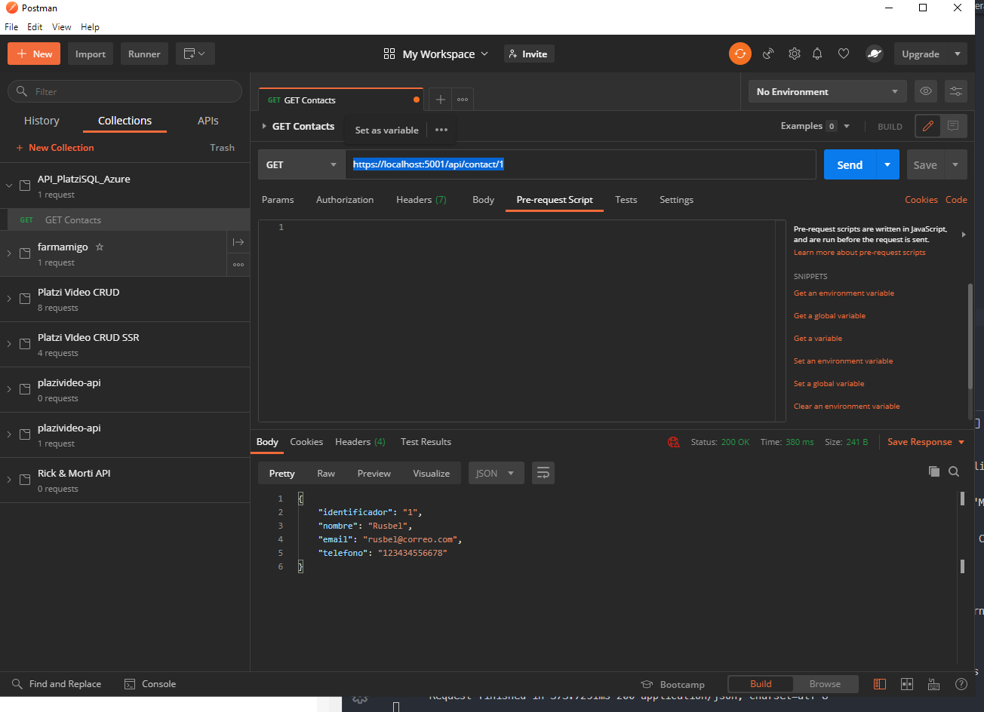

# Curso de SQL en Azure

- [Curso de SQL en Azure](#curso-de-sql-en-azure)
  - [Modulo 1 Introduccion](#modulo-1-introduccion)
    - [Clase 1 Introduccion a SQL Azure](#clase-1-introduccion-a-sql-azure)
  - [Modulo 2 Crear Bases de datos](#modulo-2-crear-bases-de-datos)
    - [Clase 2 Creando la Base de Datos en Azure SQL](#clase-2-creando-la-base-de-datos-en-azure-sql)
    - [Clase 3 Seguridad en SQL Azure](#clase-3-seguridad-en-sql-azure)
    - [Clase 4 Explorando mi base de datos desde el portal de Azure](#clase-4-explorando-mi-base-de-datos-desde-el-portal-de-azure)
    - [Clase 5 Configuracion y acceso a nuestra Base de Datos desde VSCode](#clase-5-configuracion-y-acceso-a-nuestra-base-de-datos-desde-vscode)
    - [Clase 6 Operaciones de consulta con SQL](#clase-6-operaciones-de-consulta-con-sql)
    - [Clase 7 Operaciones CRUD](#clase-7-operaciones-crud)
      - [Operación SELECT](#operación-select)
      - [Operación INSERT](#operación-insert)
      - [Operacion UPDATE](#operacion-update)
      - [Operacion DELETE](#operacion-delete)
  - [Modulo 3 Desarrollar una Web APi](#modulo-3-desarrollar-una-web-api)
    - [Clase 8 Creando una Web APi con .NET Core](#clase-8-creando-una-web-api-con-net-core)
    - [Clase 9 Agregar modelos y configuracion en mi Web Api](#clase-9-agregar-modelos-y-configuracion-en-mi-web-api)
    - [Clase 10 Configurando mi conexion a SQL](#clase-10-configurando-mi-conexion-a-sql)
    - [Clase 11 Comandos de Entity Framework Core](#clase-11-comandos-de-entity-framework-core)
    - [Clase 12 Operacion Select desde mi API](#clase-12-operacion-select-desde-mi-api)
    - [Clase 13 Publicacion y ajustes de mi Web API](#clase-13-publicacion-y-ajustes-de-mi-web-api)
    - [Clase 14 Operaciones Get y Post desde mi Web API](#clase-14-operaciones-get-y-post-desde-mi-web-api)
    - [Clase 15 Consumiendo las operaciones de mi API](#clase-15-consumiendo-las-operaciones-de-mi-api)
    - [Clase 16 Operaciones Put y Delete desde mi Web API](#clase-16-operaciones-put-y-delete-desde-mi-web-api)
      - [Operacion PUT](#operacion-put)
      - [Operacion DELETE](#operacion-delete-1)

## Modulo 1 Introduccion

### Clase 1 Introduccion a SQL Azure

SQL Azure es un Platform As A Services, permite gestionar los datos en nuestro servicio.

Ventajas

- Cero mantenimiento
- No debes preocuparte por la administración del servidor
- Disponibilidad de has 99.9%
- Siempre tendrás la version mas actualizada (mas estable y mas segura)

Seguimos los siguientes pasos

1.- Vamos a la url de azure SQL Databases en el menu lateral y damos click en crear

2.- En la pantalla de inicio llenamos los siguientes datos

**resource group:** platziSQLGroup

**server:** creat new y asignamos lo siguiente

    create New
    server name: platzisqlserver-rb
    Server admin login: TuNombre
    Password: **********
    Confirm password: **********
    Location: west us
    Allow Azure services to access server: checked

De esta forma creamos nuestro server.

## Modulo 2 Crear Bases de datos

### Clase 2 Creando la Base de Datos en Azure SQL

Database name: registrosprueba

La opción ¿Quiere usar un grupo elástico de SQL? sirve para que se adapte a las necesidades de acuerdo a sus registros dejamos la opción default, seleccionamos el modelo de procesamiento y almacenamiento por defecto, y damos click en siguiente.


Vamos a la opcion **Configuración adicional** y damos click en usar **datos existentes** opción **muestra**, finalmente damos click en revisar y crear. (esperemos mientras se hace el despliegue)

RoadMap del curso

- Definir directivas de seguridad para acceder a la base de datos
- Definir operaciones CRUD para trabajar con la BD
- Crear una webAPI para conectar con azure
- Publicar API como una app de Azure



### Clase 3 Seguridad en SQL Azure

Ya creamos el servidor y la base de datos, ahora configuramos la parte de seguridad dando click en el nombre de nuestro servidor, ubicado en la información esencial, y después en el menu lateral en la sección de seguridad opción firewalls y redes virtuales.

En ese menu nuevo establecemos una regla para que una IP publica este autorizada para acceder a SQL.

**Nunca por flojera permitas usar un rango de IP de 0 a 255, es un fallo de seguridad brutal** para que alguien no autorizado acceda, la mejor manera es siempre crear un punto según lo requieras.


Finalmente guardamos, y ahora vamos al editor de consultas (igual en el menu lateral y nos loggeamos en la base de datos).

**importante:** sql es paranoico por defecto, aunque seas el administrador y estes loggeado con tus credenciales de microsoft siempre debes configurar tu acceso como en el paso anterior para cada IP donde te encuentres trabajando, y siempre hazlo con seguridad.

### Clase 4 Explorando mi base de datos desde el portal de Azure

Ya en el editor de consultas tenemos podemos escribir nuestros queries, guardar las consultas en formato sql, y exportar los datos en los formatos json csv y xml.


### Clase 5 Configuracion y acceso a nuestra Base de Datos desde VSCode

Utilizamos la plataforma de Azure para hacer una consulta, sin embargo no es practico para un ambiente productivo, lo mejor es utilizar VSCode agregando la extension **MSSQL** (SQL Server de Microsoft), una vez instalada usamos el comando ctrl + shift + p y escribimos en la barra MS SQL y usamos la opción add connection, nos pedirá un nombre de servidor o la cadena de conexión ADO.NET la cual encontramos en el portal de Azure en la base de datos de registrosprueba y después a la categoría de Configuracion y después a **Cadenas de conexión**, y copiamos la cadena de texto.


Pegamos la cadena y damos nombre al perfil de conexión en VS Code, esto nos conectara rápidamente a la base de datos.

**importante si utilizas windows 10 y wsl2**, asegúrate de no estar en un directorio de WSL, me sucedió y perdí casi dos horas intentando las soluciones de los aportes, asegurate  trabajar en algun directorio de C (u otro directorio del sistema de archivos de windows) si vas a trabajar en ese directorio entonces utiliza VSCode con una conexión remota, haz click en la opción de la esquina inferior izquierda y selecciona reopen in WSL, agrega la conexion utilizando el ADO como primera opcion.

Esto es importante porque **wsl tiene su propio sistema de archivos aunque viva en windows, y las URI no se pueden construir** y obtendremos el error en el que muchos caimos.

Hice los pasos de la clase usando un folder en el descritorio en windows, usando VS con un folder en windows, e hice lo mismo en WSL usando VS con la configuracion de WSL y funciono pero solo para SQL Server.

Segunda opción:

- Ir a VS Code
- -Ctrl + Shift + P
- Nombre servidor (ej: mynewserver.database.windows.net)
- Nombre Bases de Datos a conectarse.
- Autenticacion (Inicio de sesion)
- Usuario (de la cuenta que administra el servidor)
- Password
- Si o no
- Nombre perfil (opcional)
  
Tercer Opción: pulsa ctrl + , y en los settings busca sql, y da click en editar el json. ahi adapta tu configuracion al siguiente ejemplo.


```json
    "mssql.connections": [

        {
            "server": "{{put-server-name-here}}",
            "database": "{{put-database-name-here}}",
            "user": "{{put-username-here}}",
            "password": ""
        },
        {
            "database": "registrosprueba",
            "user": "rusbelbermudez",
            "server": "tcp:platzisqlserver-rb.database.windows.net,1433",
            "password": "",
            "authenticationType": "SqlLogin",
            "savePassword": true
        }
    ],
```

De esta manera borando la linea que genera el error al construir la URI de conexion.

```JSON
{
    "connectionString": "Microsoft.SqlTools|itemtype:Profile|server:tcp:platzisqlserver-rb.database.windows.net,1433|db:registrosprueba|user:rusbel|isConnectionString:true",
}
```

Evitamos los conflictos que presenta la extension entre sql server (parte grafica del menu) y la herramienta SQL ahora podemos usar ambas, ahora ya podemos hacer las consultas desde un archivo ejemplo.sql, conectarnos a la base de datos con la opcion ms sql conect y realizar los quieries con ctrl + shift + e


### Clase 6 Operaciones de consulta con SQL

En esta clase realizamos operaciones

```sql

SELECT *
FROM SalesLT.ProductCategory;

-- insertamos un dato
INSERT INTO SalesLT.ProductCategory (Name, rowguid, ModifiedDate)
VALUES ('Boxers', '2d364ade-264a-433c-c092-4fcbf3804e07', '2020-09-01')

-- boramos el dato
DELETE FROM SalesLT.ProductCategory
WHERE Name='Boxers';
```

### Clase 7 Operaciones CRUD

Después de ver la configuración y una operación de consulta básica con VS Code, toca el turno de ver cómo hacer las cuatro operaciones que serán la base fundamental para modificar los datos de tus tablas.

#### Operación SELECT

Esta ya la viste cuando estuvimos hablando de la configuración.

```sql
SELECT * FROM SalesLT.ProductCategory
```

Esta operación te regresa todos los registros de tu tabla, es la mejor manera de comprobar que los cambios a la misma ya fueron hechos.


#### Operación INSERT

Esta operación es la encargada de hacer que un nuevo registro sea colocado dentro de la tabla

```SQL
INSERT INTO SalesLT.ProductCategory (Name, rowguid, ModifiedDate)
VALUES ('Coffee', 'cfbda25c-df65-47a7-b98b-64ee999aa37c',   2002-06-01)

SELECT * FROM SalesLT.ProductCategory
```

Primero estableces la opción, después colocas los campos que deseas modificar, por último, los valores de estos campos. Como lo mencioné en el punto anterior, usa la operación SELECT para ver que tu tabla tiene ya el nuevo valor insertado.


#### Operacion UPDATE

Digamos que escribiste mal una palabra o un dato ya no cuenta con el mismo valor por lo que si quieres conservar el registro, pero solo modificar un campo entonces esta es la operación indicada.

```SQL
-- Actualizamos el row
UPDATE SalesLT.ProductCategory
SET Name = 'Chocolate'
WHERE ProductCategoryID = 42

-- Verificamos el cambio
SELECT * FROM SalesLT.ProductCategory
```

Demuestras que quieres actualizar, el valor que deseas cambiar y ver cuál será el registro que quieres modificar.


#### Operacion DELETE

Esta operación es por mucho a la que más cuidado debemos darle porque con un descuido podríamos perder información muy importante.
La estructura de esta operación es la siguiente.

```SQL
DELETE FROM SalesLT.ProductCategory
WHERE ProductCategoryID = 42

SELECT * FROM SalesLT.ProductCategory
```

La más delicada y la más simple. Curioso ¿no?
Bueno, no hay mucho que decir en cuanto a la sentencia. Elimina de esta tabla el registro que cumpla con esta condición. El resultado es el siguiente:


Como verás, el registro que insertamos y actualizamos ya no se encuentra más disponible.
Con estas cuatro operaciones podrás sentar las bases de cualquier proceso que desees ejecutar aquí. Para darle un seguimiento mucho más avanzado y profundo del tema (si te interesa especializarte en esto) puedes visitar el sitio de W3Schools que cubre muchos ejercicios del lenguaje SQL.

## Modulo 3 Desarrollar una Web APi

### Clase 8 Creando una Web APi con .NET Core

Vimos como hacer las operaciones basicas (CRUD) en una base de datos, eso aplica cuando administrar la base de datos, en el modo produccion tenemos interfaces graficas, las cuales por recomendacion de seguridad no deben enlazarse a las bases de datos ahi es donde debemos usar APIS (Aplication Public Interface).

En este ejercicio realizaremos una API, instalamos DOTNET desde la pagina de windows

<https://dotnet.microsoft.com/download/dotnet-core/2.1>

**NOTA: SI ESTAS EN LA RUTA DE ESCUELA DE CIENCIA DE DATOS ES IMPORTANTE QUE INSTALES LA VERSION 2.1, SI USAS LA VERSION 3.1 HAN CAMBIADO MUCHAS COSAS Y EN LAS SIGUIENTES CLASES VAS A TENER QUE REGRESAR A ESTE PUNTO. ESTAS ADVERTIDO**.

```bash
dotnet new
```

Instalamos los templates

```bash
dotnet new --install "Microsoft.DotNet.Web.ProjectTemplates.2.1"


```

Y nos despliega un menu de opciones, seleccionamos **webapi** escribiendo

```bash
dotnet new webapi -n "ApiSQLPlatzi"
```

Esto nos crea el forlder ApiSQLPlatzi

Compila el proyecto con el siguiente comando

```bash
dotnet run

```

Y probmos nuestra api con la url <https://localhost:5001/WeatherForecast>

la cual nos arroja data en formato json en nuestro navegador, si tuilizas chrome te recomiendo la extension JSON Viewer

### Clase 9 Agregar modelos y configuracion en mi Web Api

Un tip para trabajar con webApis es hacer una lista de pasos a seguir para cada endpoint y ganar practica para que el proceso de vuelva intiuitivo para ti.

En la carpeta del proyecto creamos el folder **ApiSQLPlatzi/Models** y dentro el archivo **Contacts.cs**

Creo el modelo

```C#
namespace ApiSQLPlatzi.Models
{
    public class Contacts
    {
        public string Identificador { get; set;}
        public string Nombre { get; set;}
        public string Email { get; set;}
        public string Telefono { get; set;}

    }
}
```

Usaremos como puente la herramienta entity framework core y entity framework core sql server
<https://www.nuget.org/packages/Microsoft.EntityFrameworkCore/5.0.0-rc.1.20451.13>
<https://www.nuget.org/packages/Microsoft.EntityFrameworkCore.SqlServer/3.1.6>

Copiamos del menu lo siguiente y lo agregamos al archivo ApiSQLPLatzi.csproj

```C#
<Project Sdk="Microsoft.NET.Sdk.Web">

  <PropertyGroup>
    <TargetFramework>netcoreapp3.1</TargetFramework>
  </PropertyGroup>


  <ItemGroup>
    <PackageReference Include="Microsoft.EntityFrameworkCore.Design" Version="2.1.1"/>
    <PackageReference Include="Microsoft.EntityFrameworkCore.SqlServer" Version="2.1.1" />
    <PackageReference Include="Microsoft.EntityFrameworkCore" Version="2.1.1" />
  </ItemGroup>


</Project>
```

Ejecutamos lo siguiente

```bash
dotnet restore
# trarnos las depentencias de nuget

dotnet build
# para compilar sin correlo
```

### Clase 10 Configurando mi conexion a SQL

Creamos `Models/ContactsContext.cs`

```C#
using Microsoft.EntityFrameworkCore;

namespace  ApiSQLPlatzi.Models
{
    public class ContactsContext: DbContext
    {public ContactsContext(DbContextOptions options): base (options)
    {

    }

    public DbSet<Contacts> ContactsSet {get; set;}

    }
}
```

Vamos al archivo appsettings.json y lo modificamos para recibir los parametros de conexion y el ADO para conectarnos

```json
{
  "ConnectionStrings": {
    "DefaultConnection": "Server=tcp:platzisqlserver.database.windows.net,1433;Initial Catalog=registrosprueba;Persist Security Info=False;User ID=rusbelb;Password={tu_pasword};MultipleActiveResultSets=False;Encrypt=True;TrustServerCertificate=False;Connection Timeout=30;"
  },
  "Logging": {
    "LogLevel": {
      "Default": "Information",
      "Microsoft": "Warning",
      "Microsoft.Hosting.Lifetime": "Information"
    }
  },
  "AllowedHosts": "*"
}
```

Ahora vamos a la clase **Startup.cs**, aqui se muestra como la aplicacion establece su ciclo de vida, iremos a **ConfigureServices** donde pondremos la cadena de conexion de la api y cargaremos las librerias con **using** de **ApiSQLPlatzi.Models** y **Microsoft.EntityFrameworkCore**

```C#
using System;
using System.Collections.Generic;
using System.Linq;
using System.Threading.Tasks;
using Microsoft.AspNetCore.Builder;
using Microsoft.AspNetCore.Hosting;
using Microsoft.AspNetCore.HttpsPolicy;
using Microsoft.AspNetCore.Mvc;
using Microsoft.Extensions.Configuration;
using Microsoft.Extensions.DependencyInjection;
using Microsoft.Extensions.Hosting;
using Microsoft.Extensions.Logging;
using ApiSQLPlatzi.Models;
using Microsoft.EntityFrameworkCore;

namespace ApiSQLPlatzi
{
    public class Startup
    {
        public Startup(IConfiguration configuration)
        {
            Configuration = configuration;
        }

        public IConfiguration Configuration { get; }

        // This method gets called by the runtime. Use this method to add services to the container.
        public void ConfigureServices(IServiceCollection services)
        {
            string connectionString = Configuration.GetConnectionString("DefaultConnection");
            services.AddDbContext<ContactsContext>(opt => opt.UseSqlServer(connectionString));
            services.AddControllers();
        }

        // This method gets called by the runtime. Use this method to configure the HTTP request pipeline.
        public void Configure(IApplicationBuilder app, IWebHostEnvironment env)
        {
            if (env.IsDevelopment())
            {
                app.UseDeveloperExceptionPage();
            }

            app.UseHttpsRedirection();

            app.UseRouting();

            app.UseAuthorization();

            app.UseEndpoints(endpoints =>
            {
                endpoints.MapControllers();
            });
        }
    }
}

```

### Clase 11 Comandos de Entity Framework Core

Entity Framework Core es el gestor entre todos los elementos que estaremos trabajando, en esta parte la API esta completa, lo que sigue es usar la herramienta de Entity Framework Core para establecer la comunicacion final por medio de comandos

```bash
    dotnet tool install --global dotnet-ef
    PATH="$PATH:$HOME/.dotnet/tools/"
    dotnet ef migrations add InitialCreate
    dotnet ef database update

```

Agrego la llave primaria a la clase Contacts

```C#
using System.ComponentModel.DataAnnotations;

namespace ApiSQLPlatzi.Models
{
    public class Contacts
    {
        [Key]
        public string Identificador { get; set;}
        public string Nombre { get; set;}
        public string Email { get; set;}
        public string Telefono { get; set;}
    }
}
```

Puedes usar el comando

Aparecio la carpeta Migrations con 3 archivos que cambian cuando cambiamos.

- 20200927225934_InitialCreate con el comando create table
- Las otras clases solo tienen la estructura

Escribimos los cambios en la base de datos.

```C#
ef migrations remove
```

Para deshacer los cambios si te equivocaste al definir alguna variable, es un punto de nor retorno.

El siguiente comando actualiza la base de datos de acuerdo al modelo.

```bash
dotnet ef database update
```

Es de observar que los scripts de sql provienen de las clases y todo se realiza de manera automatica, verificamos que se haya creado la tabla

```SQL
SELECT *
FROM dbo.ContactsSet
```

### Clase 12 Operacion Select desde mi API

En la clase anterior definimos el ContactsSet con el dbSet, esto hace toda la magia.

Ahora insertemos algunos registros registros con la sentencia INSERT INTO guiate en los ejemplos de clases anteriores.

Revisa que cuentes con los registros

```SQL
SELECT *
FROM dbo.ContactsSet
```

Agregamos un nuevo controlador en el proyecto (clase) para acceder a los datos de la API en `Controllers/ContactControllers.cs`

```C#
using Microsoft.AspNetCore.Mvc;
using System.Collections.Generic;
using System.Linq;
using ApiSQLPlatzi.Models;

namespace ApiSQLPlatzi.Controllers
{
    [Route("api/[controller]")]
    [ApiController]
    public class ContactController : Controller
    {
        // obtenemos el contexto de la app
        private ContactsContext contactsContext;

        public ContactController(ContactsContext context)
        {
            contactsContext = context;
        }

        // GET api/values
        [HttpGet]
        public ActionResult<IEnumerable<Contacts>> Get()
        {
            return contactsContext.ContactsSet.ToList();
        }

        // creamos metodo destructor
        ~ContactController()
        {
            contactsContext.Dispose();
        }

    }
```

### Clase 13 Publicacion y ajustes de mi Web API

Corremos la api en local

```bash
dotnet run
```

Ingresamos a la url <https://localhost:5001/api/contact> en el navegador y comprobamos que funciona, ahora vamos a postman.

En postman vamos a File/Settings y deshabilitamos temporalmente la seguiridad del certificaod SSL, creamos una nueva coleccion para nuestra API y hacemos una peticion get.


Un truco es darle antes del request a la parte de **code** en postman donde podemos optener la misma peticion en diferentes lenguajes


Lo siguiente es hacer nuestra API publica

```bash
dotnet publish -c Release -o ./publish
```

Ahora en VSCode instalamos la **Azure Tools** damos click derecho en la carpeta publish recien creada y seleccionamos la opcion **deploy to web app** y lo nombramos como "platzi-web-api-contact", al intentar correr tu app agrega /api/contact, mira los logs de error de la app, busca el ip publico de azure y agregalo a la lista de IP's como lo hicimos al inicio, ahora tu app debe funcionar y servir json.

### Clase 14 Operaciones Get y Post desde mi Web API

Copiamos de `ValuesController.c`s el resto de las operaciones y modificamos `ContactControllers.cs` donde agremamos los metodos get by id y post

```C#
using Microsoft.AspNetCore.Mvc;
using System.Collections.Generic;
using System.Linq;
using ApiSQLPlatzi.Models;

namespace ApiSQLPlatzi.Controllers
{
    [Route("api/[controller]")]
    [ApiController]
    public class ContactController : Controller
    {
        // obtenemos el contexto de la app
        private ContactsContext contactsContext;

        public ContactController(ContactsContext context)
        {
            contactsContext = context;
        }

        // GET api/values
        [HttpGet]
        public ActionResult<IEnumerable<Contacts>> Get()
        {
            return contactsContext.ContactsSet.ToList();
        }

        // GET api/values/5
        [HttpGet("{id}")]
        public ActionResult<Contacts> Get(int id)
        {
            var selectedContact = (from c in contactsContext.ContactsSet
                                   where System.Convert.ToInt32(c.Identificador) == id
                                        select c).FirstOrDefault();

            return selectedContact;
        }

        // POST api/values
        [HttpPost]
        public IActionResult Post([FromBody] Contacts value)
        {
            Contacts newContact = value;
            contactsContext.ContactsSet.Add(newContact);
            contactsContext.SaveChanges();
            return Ok("Tu contacto ha sido creado");
        }

        // PUT api/values/5
        [HttpPut("{id}")]
        public void Put(int id, [FromBody] string value)
        {
        }

        // DELETE api/values/5
        [HttpDelete("{id}")]
        public void Delete(int id)
        {
        }

        // creamos metodo destructor
        ~ContactController()
        {
            contactsContext.Dispose();
        }


    }
}
```

### Clase 15 Consumiendo las operaciones de mi API

Realizaremos la revision de los metodos anteriores con postman, donde usaremos la direccion <https://localhost:5001/api/contact/1> para traernos el primer elemento.



Ahora insertamos un registro con el metodo POST, primero definimos los headers


Ahora creamos el body


### Clase 16 Operaciones Put y Delete desde mi Web API

Después de continuar con las operaciones de consulta por parámetros y la de inserción, es momento de que vayas por las dos operaciones restantes. ¿Comenzamos?

#### Operacion PUT

Acabo de insertar un nuevo registro gracias a mi operación de inserción. Puse un registro así.


Como verás, hubo un error en los campos, el nombre y apellido del contacto están mal así que debemos modificarlo. Vuelve a tu proyecto y buscar tu método Put en la clase ContactController.cs. y agrega lo siguiente.

```C#
[HttpPut("{id}")]
        public void Put(int id, [FromBody] Contacts value)
        {
            Contacts updatedContact = value;
            var selectedElement = contactsContext.ContactSet.Find(updatedContact.Identificador);
            selectedElement.Nombre = value.Nombre;
            selectedElement.Email = value.Email;
            contactsContext.SaveChanges();
        }
```

Lo primero que necesitas es obtener el contacto, igual que en el método de inserción, solo que ahora, podrás obtener este contacto de tu base para que primero sepas cuál será el dato que vas a modificar. Cambia las propiedades que quieres modificar, puedes hacerlo a tu gusto. Solo que después de eso debes guardar los cambios.

Corre tu aplicación (ya sabes, dotnet run) y después de eso ve a Postman, inserta un JSON parecido a esto.

```C#
{
“identificador”: 1,
“nombre”: “Amin Espinoza”,
“email”: "amin.espinoza@correo.com",
“telefono”: “5543507148”
}
```

O con los cambios que te acomoden y cambia la operación a PUT.


Los pasos a seguir son muy parecidos a los de la inserción. En esta secuencia de pasos se trata de:

1.- Cambiar la operación por PUT, ten muchísimo cuidado en ver la URL. ¿Notaste que el identificador del elemento que quiero modificar se encuentra al final de la cadena? A mi me tomó como dos días darme cuenta de eso la primera vez que lo hice. Lo peor es que si no lo haces nada te indicará donde está el error.

2.- Selecciona la opción de Body y en la categoría raw puedes comenzar a escribir.

3.- Escribe en formato JSON el identificador que vas a buscar y además los campos que vas a modificar.

Si realizas la operación de la manera adecuada obtendrás un 200 OK en Postman.


#### Operacion DELETE

En esta operación podemos trabajar para eliminar los registros. La idea es borrar el registro que acabamos de crear y de nuevo nos vamos a apoyar en el identificador. Como siempre en esta vida, nos tardamos mucho en construir y eliminar nos toma muy poco tiempo y además resulta ser el método más fácil de todos.
De vuelta a tu proyecto, colócate en el método DELETE de tu aplicación y agrega lo siguiente.

```C#
        public void Delete(int id)
        {
            var selectedElement = contactsContext.ContactSet.Find(id);
            contactsContext.ContactSet.Remove(selectedElement);
            contactsContext.SaveChanges();
        }
```

Como verás, no hay mucho que decir ¿o sí? Simplemente tomas tu identificador recibido, buscas el elemento que tiene ese identificador y lo borras, si, así de fácil las cosas se van.
Prueba tu método en Postman, ahora no necesitas enviar nada más que el id en tu URL (igual que en los métodos anteriores) y estarás listo.


Muy bien, pues ahora solo basta publicar de nuevo la aplicación para que puedas tener todos tus métodos listos para empezar a gestionar tus contactos.
